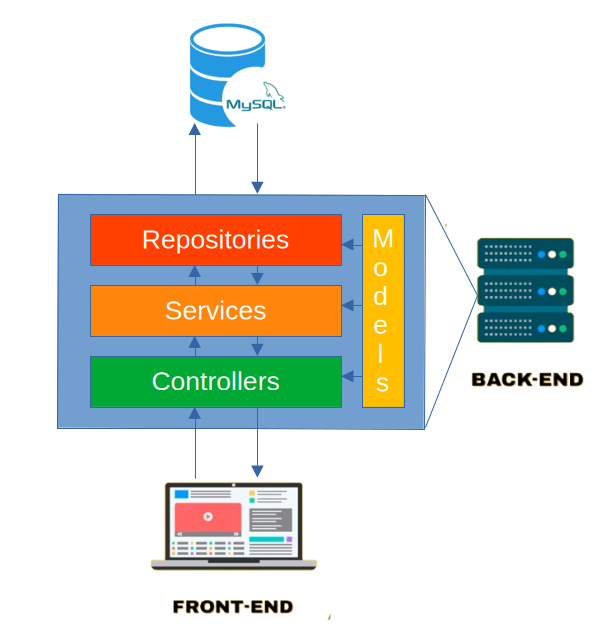

# Estrutura de camadas do projeto 🏗️

A estrutura principal do projeto se organiza na forma de quatro camadas principais que gerenciam e organizam todos os processos do Backend, que fazem a ponte de ligação entre o frontend e o banco de dados MySQL.

## As camadas
1. **Controllers**: camada responsável por preparar dados para o frontend, é a camada mais próxima do front e responsável por coordenar todas as interações com o back. 
2. **Services**: Camada responsável por disponibilizar os serviços de processamento de dados para os controller, é aqui onde os dados serão processados antes de serem utilizados pelo front ou armazenados pelo banco de dados.
3. **Repositories**: Camada que determina as regras de interação com o banco de dados, é responsável por manipular dados diretamente no Banco de dados.
4. **Models**: Camada dos objetos que serão utilizados pelas outras camadas e que representam os dados manipulados pelo back end.

## Estrutura
A estrutura de dados está representado pela imagem abaixo:

Cada camada contém classes referentes aos objetos a serem representados no projeto, para ver com mais detalhes os objetos a serem manipulados dentro da aplicação, veja a [estrutura de dados](data-structure.md) do projeto.