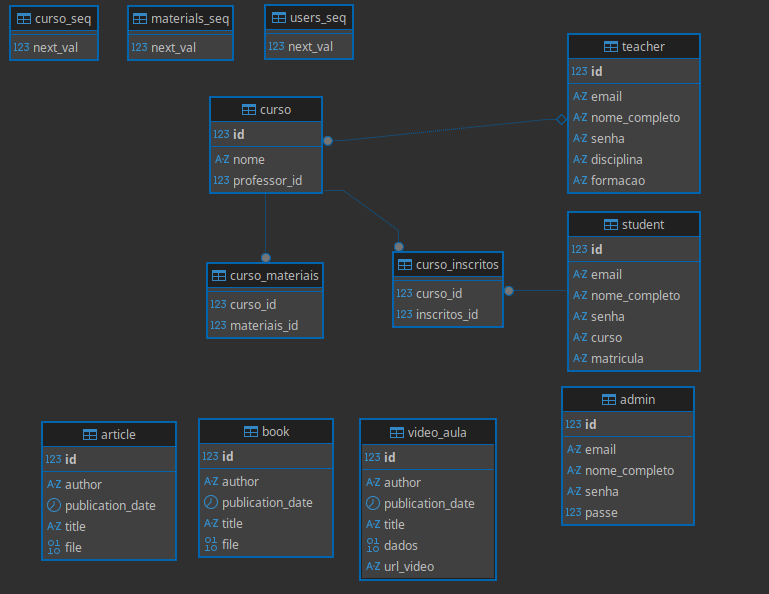

# Estrutura de dados 🗂️

A [arquitetura de camadas](Layers-Project.md) do projeto esta projetada de forma orientada a objetos, cujo as informações serão armazenadas no banco de dados MySQL e gerenciadas através das camadas de repositories e services.

A seguir, tem-se uma descrição detalhada de como as informações estão dispostas no banco e como se interligam.

## 1. Usuários ([Users](../src/main/java/com/estudolivre/ProjetoPDS/models/Users.java))
Esta parte se trata de uma classe mais abrangente que determina características em comum a todos os usuáros que podem ser cadastrados no sistema.

De forma geral, todos os usuários tem alguns dados em comum, que são:

- ID, que é gerado automaticamente
- Nome
- Email
- Senha

Essas características são gerais e universais entre todos os usuários, porém existem certos atributos que podem se distinguir a depender dos tipos de usuários, a seguir haverão uma descrição dos tipos de usuários e suas características particulares.

### 1.1. Administradores ([Admin](../src/main/java/com/estudolivre/ProjetoPDS/models/Admin.java))

São usuários com permissões administrativas superiores, responsáveis por fazer a moderação do sistema, garantindo que seja uma ambiente seguro para todos os usuários.

Esse tipo de usuário tem todos os atributos de sua classe mãe, com um acressimo de um atributo "passe", que se refere a um passe de administrador que servirá para identificar aqueles que tem autorização para adminstração do sistema.

### 1.2. Estudantes ([Student](../src/main/java/com/estudolivre/ProjetoPDS/models/Student.java))

Se trata principalmente do usuários consumidores da plataforma, eles terão acesso aos materiais disponibilizados pelos usuários do tipo professor, podendo fazer download dos conteúdos.

Ele utiliza dos atibutos comuns de usuários, porém ele detém das seguintes características exclusivas dele:

- Matrícula
- Curso

### 1.3. Professores ([Teachers](../src/main/java/com/estudolivre/ProjetoPDS/models/Teachers.java))

São os usuários principalmente publicadores dos conteúdos da plataforma, eles podem fazer upload dos materiais didáticos além de criar cursos com materiais direcionados ao conteúdo abordado, além de poderem consumir o conteúdo já publicado.

Ele também tem os atributos comuns de usuário, além dos seus atributos exclusivos, que são:

- disciplina
- formação

## 2. Materiais ([Materials](../src/main/java/com/estudolivre/ProjetoPDS/models/Materials.java))
Serão os conteúdos postados pelos professores, também se trata de uma classe mais abrangente para os tipos de objetos que teram as características de materiais em comum.

De forma geral, os materiais terão os seguintes atributos em comum:

- ID, gerado automaticamente
- Autor
- Título
- Data de publicação

Assim como os usuários, os materiais também se dividem em tipos com características específicas.

### 2.1. Artigos ([Article](../src/main/java/com/estudolivre/ProjetoPDS/models/Article.java))

Artigos publicados por instituições de pesquisa e disponibilizados na plataforma pelos professores para fonte dos conteúdos.

Os artigos tem os mesmos atributos comuns a todos os materiais, com um acrescimo de um atributo "file", que é onde o arquivo com o conteúdo do artigo é armazenado.

### 2.2. Livros ([Book](../src/main/java/com/estudolivre/ProjetoPDS/models/Book.java))

Livros didáticos ou literários que podem servir como materiais de estudos e consulta de conteúdo.

Os livros tem os mesmos atributos comuns a todos os materiais, com um acrescimo de um atributo "file", que é onde o arquivo com o conteúdo do livro é disposto.

### 2.3. Vídeos ([VideoAula](../src/main/java/com/estudolivre/ProjetoPDS/models/VideoAula.java))
Vídeos explicativos ou didáticos que auxiliam no entendimento ou na visualização do conteúdo.

Detém dos mesmos atributos comum a outros materiais, com o acrescimo de dois atributos:

- Dados
- URL

Adendo para o fato que o usuário professor poderá anexar um arquivo no formato mp4 ou uma URL para que o vídeo seja transmitido na plataforma.

## 3. Cursos ([Curso](../src/main/java/com/estudolivre/ProjetoPDS/models/Curso.java))

Cursos se refere a uma forma de organização de materiais compartilhados na plataforma.

Professores tem a possibilidade de criar cursos, e colocarem quaisquer materiais que ajudem no estudo do conteúdo proposto pelo curso. Por sua vez, estudantes podem se tornarem inscritos nos cursos que desejarem para poderem acompanhar seus materiais de forma mais facilitada.

Os cursos tem os seguintes atributos:

- Id
- Nome
- Professor
- Materiais
- Inscritos

Sendo os atributos de Professor, Materiais e Inscritos, atributos que determinam relações de [cardinalidade](https://www.escoladnc.com.br/blog/entendendo-os-tipos-de-cardinalidade-em-modelagem-de-bancos-de-dados) com os outros objetos do sistema, sendo relação de Muitos para Um e Muitos para Muitos, respectivamente.

---

Todos esses objetos entidades, definidos dessa maneira no sistema, proporcionam uma estrutra de dados no banco robusta e eficaz no armazenamento e relacionamento dos dados trafegados pelo sistema.

Abaixo é possível visualizar um diagrama de como os tipos de dados serão dispostos no banco, como também suas relações entre si:

